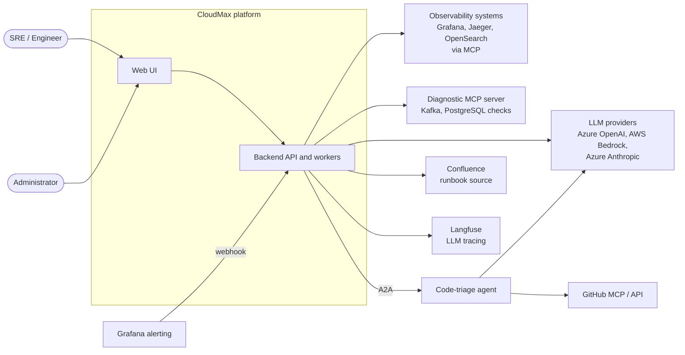
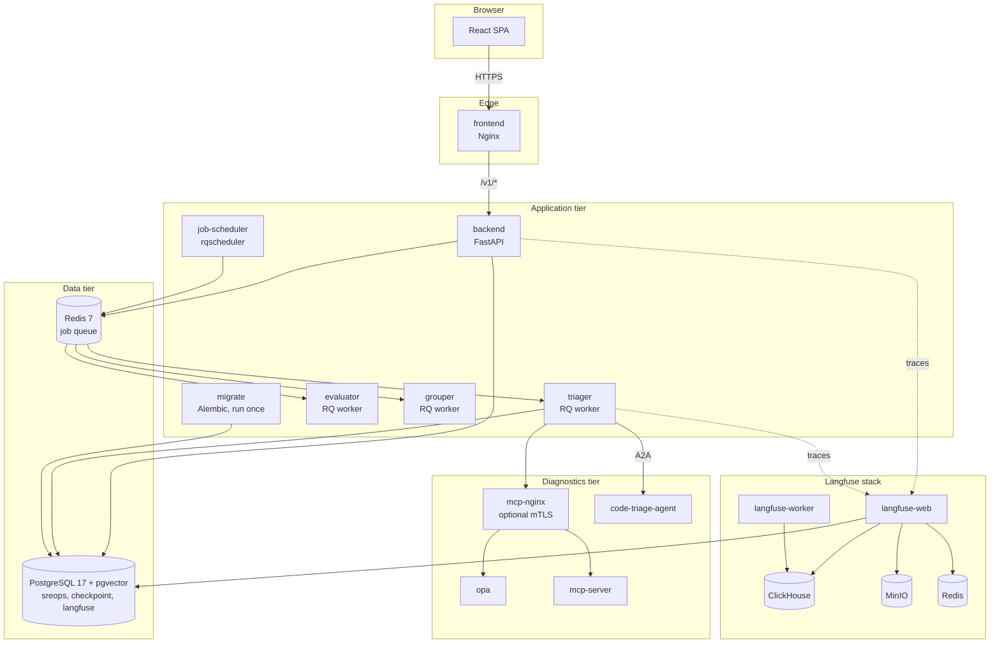
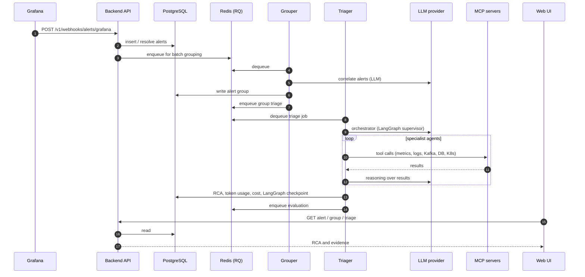
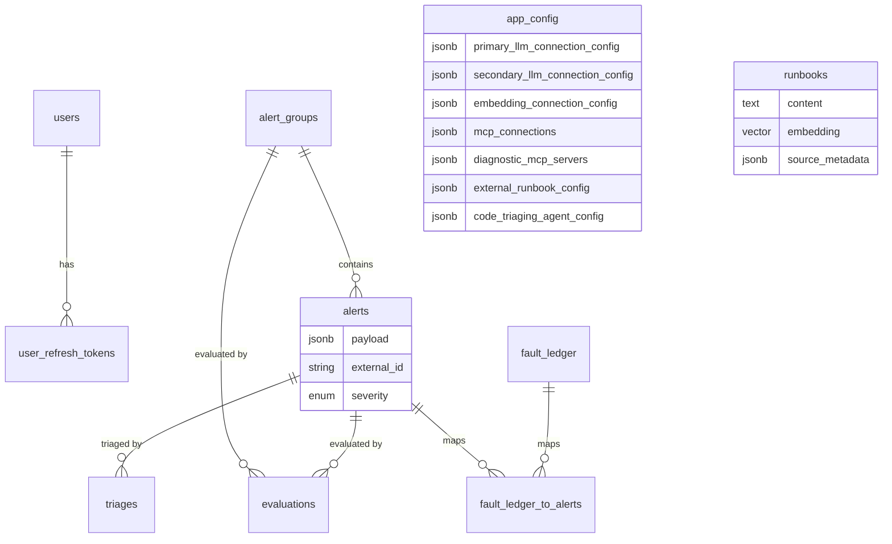
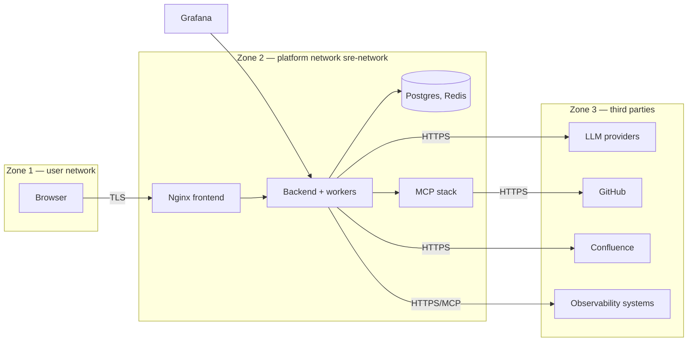

# CloudMax — Technical Architecture

| | |
|---|---|
| **Applies to** | Repository `main` branch |
| **License of this project** | Apache License 2.0 (see [LICENSE](../LICENSE)) |
| **Related** | [README](../README.md) · [SECURITY](../SECURITY.md) · [THIRD_PARTY_NOTICES](../THIRD_PARTY_NOTICES.md) · [MCP server](../diagnostics/mcp-server/README.md) · [Code-triage agent](../agents/code-triage/README.md) |

## 1. Purpose and scope

CloudMax is an AI-assisted Site Reliability Engineering (SRE) platform. It ingests
monitoring alerts (currently Grafana webhooks), groups related alerts, and uses an
LLM-driven multi-agent workflow to perform root-cause analysis (RCA) by querying
observability systems and running read-only diagnostics. Engineers review the results
in a web dashboard.

This document describes the system as implemented in the repository: components,
data flows, data stores, external dependencies, trust boundaries, and deployment.
It does not describe any specific production environment.

## 2. System context

## 3. Repository layout

| Path | Component | Language / runtime |
|---|---|---|
| `core/backend/` | REST API, async workers, triage/evaluation/grouping logic, Alembic migrations | Python 3.12, FastAPI |
| `core/frontend/` | Single-page dashboard served by Nginx over HTTPS | TypeScript, React 18, Vite 7 |
| `diagnostics/mcp-server/` | Diagnostic MCP server (Kafka lag, PostgreSQL health), Nginx mTLS proxy, OPA policy | Python, FastMCP |
| `agents/code-triage/` | Separately deployable code-triage agent exposing an A2A endpoint | Python 3.11, LangGraph |
| `demos/booking-demo/` | Optional demo-specific diagnostic tools and runbook | Python |
| `docker-compose*.yml`, `Makefile` | Full-stack and development orchestration | Docker Compose v2, GNU Make |

## 4. Container view

All backend roles run from one image (`core/backend/Dockerfile`); the role is chosen by the
`MODE` environment variable in `core/backend/entrypoint.sh` (`server`, `triager`,
`evaluator`, `grouper`, `job-scheduler`, `migrate`).

### 4.1 Backend (`core/backend/src`)

| Package | Responsibility |
|---|---|
| `server/web.py` | FastAPI app, CORS, `/health`, router registration |
| `server/apis_v1/` | HTTP routers: `alerts`, `alert-groups`, `runbooks`, `webhooks`, `stats`, `config`, `knowledge-base`, `auth`, `users`, `fault-ledger` (all under `/v1`) |
| `server/models/db/` | SQLAlchemy models (alerts, groups, triages, evaluations, runbooks, app config, users, refresh tokens, fault ledger) |
| `server/models/api/` | Pydantic request/response schemas and provider config models |
| `server/utilities/` | Config loading (DB or environment), LLM/embedding managers, JWT/bcrypt helpers, Redis queue, token rate limiter, LangGraph checkpointer |
| `server/async_workers/` | RQ worker entry points and periodic jobs (batch grouping, cleanup, stuck-group cleanup, ungrouped retry, Confluence sync) |
| `server/services/confluence/` | Confluence client, page fetching, HTML-to-Markdown conversion |
| `alert_grouping/` | LLM-assisted alert correlation and group triage |
| `triage/` | Orchestrator workflow, specialist agents, agent tools (MCP, RAG, date/time) |
| `triage_evaluation/` | DeepEval-based quality metrics for triage output |
| `server/migrations/` | Alembic migrations, applied automatically by the `migrate` service |

### 4.2 Frontend (`core/frontend/src`)

React SPA using Redux Toolkit and TanStack Query for state, React Router for navigation,
Radix UI primitives with locally vendored shadcn/ui components, Recharts for charts and
Monaco editor for runbook editing. It is built in a multi-stage Docker build and served
by Nginx, which terminates TLS and reverse-proxies `/v1/`, `/docs` and `/openapi.json` to
the backend.

### 4.3 Diagnostic MCP server (`diagnostics/mcp-server`)

FastMCP server exposing read-only diagnostic tools over streamable HTTP:
`get_consumer_lag_tool` (Kafka), `db_check_access_tool`, `db_check_write_locks_tool`,
`db_check_connections_tool` (PostgreSQL), and `health_check`. It sits behind an Nginx proxy
that can enforce mutual TLS. When `MTLS_ENABLED=true`, an OPA sidecar
(`policies/authz.rego`) authorizes requests against a policy. Mutual TLS is optional and
is configured per deployment.

### 4.4 Code-triage agent (`agents/code-triage`)

A LangGraph workflow (error parser → retrieval planner → code retrieval → code analyzer →
report) exposed through an A2A (agent-to-agent) FastAPI app. It reads source
files from GitHub through a GitHub MCP endpoint using a personal access token, and uses an
AWS Bedrock Claude model for reasoning. It is optional and enabled through application
configuration.

## 5. Alert-to-RCA data flow

Key behaviours:

- **Ingestion.** Firing alerts are inserted; resolved alerts mark matching unresolved rows as resolved.
  Severity strings are normalised to P1/P2/P3.
- **Grouping.** `batch_grouping_job` periodically groups ungrouped alerts using an LLM.
  Grouping can be disabled in configuration.
- **Triage.** `OrchestratorWorkflow` (LangGraph Supervisor) hands off to specialist agents:
  Kafka, Kubernetes, APM, Database, Diagnostic Tests and (optionally) Code Triage. A
  knowledge-base RAG tool searches runbooks stored with pgvector embeddings.
- **Persistence of reasoning.** LangGraph checkpoints are stored in PostgreSQL
  (`checkpoint` database).
- **Cost and rate control.** Token usage and USD cost are recorded per triage; an optional
  Redis-backed token rate limiter is available (`ENABLE_TOKEN_RATE_LIMITING`).
- **Evaluation.** An evaluator worker scores output with DeepEval metrics (root-cause
  similarity, orchestrator and sub-agent task completion and tool use).

## 6. Data architecture

| Store | Contents | Notes |
|---|---|---|
| PostgreSQL `sreops` | All application tables above, runbook embeddings (pgvector) | Schema managed by Alembic |
| PostgreSQL `checkpoint` | LangGraph agent state per triage thread | Contains full agent conversation state, including tool output |
| PostgreSQL `langfuse` | Langfuse metadata | Shared Postgres instance in the default stack |
| Redis (queue) | RQ jobs; password-protected; RDB + AOF persistence | Separate Redis instance for Langfuse |
| ClickHouse / MinIO | Langfuse trace events and blobs | Langfuse stack only |

## 7. Security architecture

### 7.1 Trust boundaries

### 7.2 Security-relevant design

| Area | Implementation |
|---|---|
| Transport (UI) | The frontend Nginx terminates TLS 1.2/1.3, redirects HTTP to HTTPS and sets standard security headers (HSTS, `X-Frame-Options`, `X-Content-Type-Options`, CSP). The bundled certificate is for development only. |
| User authentication | Username/email and password with bcrypt hashing; short-lived JWT access tokens and refresh tokens stored hashed. User-management routes are restricted to administrators. |
| API scope | User-facing routes (alerts, groups, runbooks, stats, configuration, knowledge base) use bearer-token authentication. Machine-to-machine endpoints, such as alert webhooks, are intended to sit on a trusted network segment or behind the operator's own gateway. |
| Secrets | Configuration is read from `.env` files (excluded by `.gitignore`) or from the application configuration store. No secrets are committed to the repository. |
| Diagnostic MCP | Optional mutual TLS at Nginx with an OPA policy sidecar; diagnostic tools are read-only and time-limited. |
| Data stores | Redis requires a password; Postgres and Redis host ports are bound to loopback in the Compose files. |
| Input handling | Pydantic validation on API payloads; parameterised SQL through SQLAlchemy/asyncpg. |
| Observability | Langfuse tracing of LLM calls; structured application logging. |

For vulnerability reporting see [SECURITY](../SECURITY.md).

## 8. External dependencies and data egress

| Integration | Direction | Protocol | Credentials | Purpose |
|---|---|---|---|---|
| Azure OpenAI | Outbound | HTTPS | API key | Chat LLM, embeddings |
| AWS Bedrock (Claude) | Outbound | HTTPS (AWS SDK) | AWS keys / Bedrock key | Chat LLM, code-triage LLM |
| Azure-hosted Anthropic | Outbound | HTTPS | API key | Chat LLM |
| Grafana / Jaeger / OpenSearch MCP | Outbound | Streamable HTTP, optional mTLS | HTTP headers, certs | Observability queries |
| Diagnostic MCP server | Outbound | Streamable HTTP, optional mTLS | Client cert | Kafka/PostgreSQL diagnostics |
| GitHub (MCP + REST) | Outbound from code-triage | HTTPS | Personal access token | Read source files |
| Confluence | Outbound | HTTPS | API token | Import and sync runbooks |
| Langfuse | Internal (self-hosted) | HTTP | Project public/secret key | LLM tracing |
| Langfuse usage telemetry | Outbound | HTTPS | None | Controlled by `TELEMETRY_ENABLED` in `docker-compose.yml` (set to `true`) |
| LangSmith | Outbound, disabled by default | HTTPS | API key | Optional tracing |

The LLM provider list is defined in `server/models/api/enums.py` (`LlmProvider`,
`EmbeddingProvider`). The provider and endpoint are chosen by the administrator in the
Setup UI, so the data-processing location is a deployment decision.

Content sent to the selected LLM and embedding providers includes alert payloads, tool and
diagnostic output, and retrieved runbook text. The code-triage agent additionally sends
source-code snippets fetched from GitHub to its LLM provider. The terms of each provider
govern retention and processing of that content.

## 9. Technology stack and licensing

Direct dependencies are declared in `core/backend/py_requirements.txt`,
`agents/code-triage/requirements.txt`, `diagnostics/mcp-server/requirements.txt` and
`core/frontend/package.json`. Attributions for bundled third-party software are in
[THIRD_PARTY_NOTICES](../THIRD_PARTY_NOTICES.md). Licenses are those published by each
project for the resolved version.

### 9.1 Notable licenses and components

| Item | Where | License / note |
|---|---|---|
| `psycopg[binary]`, `psycopg2-binary` | Backend, MCP server | LGPL-3.0, used unmodified as a dynamically linked library. |
| `azure-cli` | Backend `py_requirements.txt` | MIT; has a large transitive dependency tree. |
| `langchain_mcp_adapters-0.2.0` wheel | `core/backend/wheels/` | MIT. Vendored as a prebuilt wheel. |
| shadcn/ui components, Tailwind CSS | Frontend | MIT. |
| `minica` | Frontend Dockerfile build stage | MIT. Used only at build time to create a development certificate. |
| MinIO (`quay.io/minio/minio`) | `docker-compose.yml` (Langfuse blob store) | AGPL-3.0. Unmodified upstream image, pulled at runtime and not redistributed by this repository. |
| Redis (`redis:7`) | `docker-compose.yml` | Redis licensing differs by version: BSD-3-Clause up to 7.2, RSALv2/SSPL for 7.4, and AGPL-3.0 as an option from 8.0. The tag floats; users should pin a version and review its license. |
| ClickHouse | `docker-compose.yml` | Apache-2.0. |
| Langfuse | `docker-compose.yml` | MIT (core). |
| Open Policy Agent | `docker-compose.yml` | Apache-2.0. |
| pgvector | `docker-compose.yml` | PostgreSQL License. |
| Nginx | Frontend and MCP proxy images | BSD-2-Clause. |
| LLM providers | Runtime | Azure OpenAI, AWS Bedrock and Anthropic terms apply to prompts and outputs. |

Container images are pulled from their upstream registries and are not redistributed by
this repository. Some images in the Compose files use floating tags (for example
`redis:7`, `langfuse:3`, `nginx:alpine`, and ClickHouse without a tag); `openpolicyagent/opa`
and MinIO are pinned.

